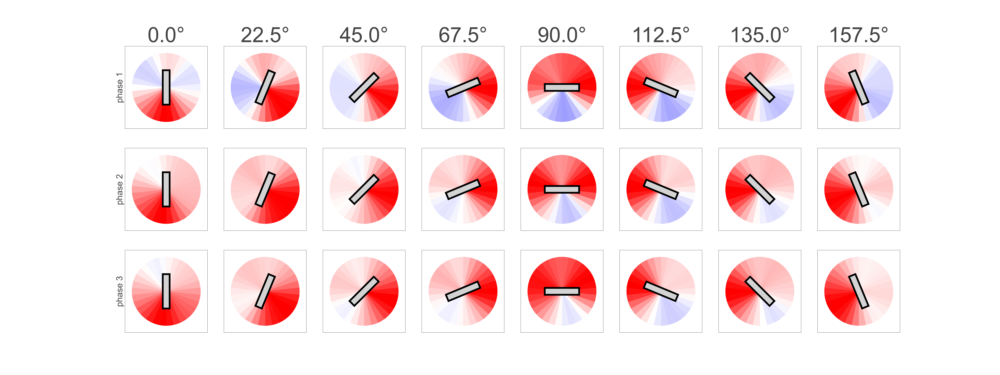
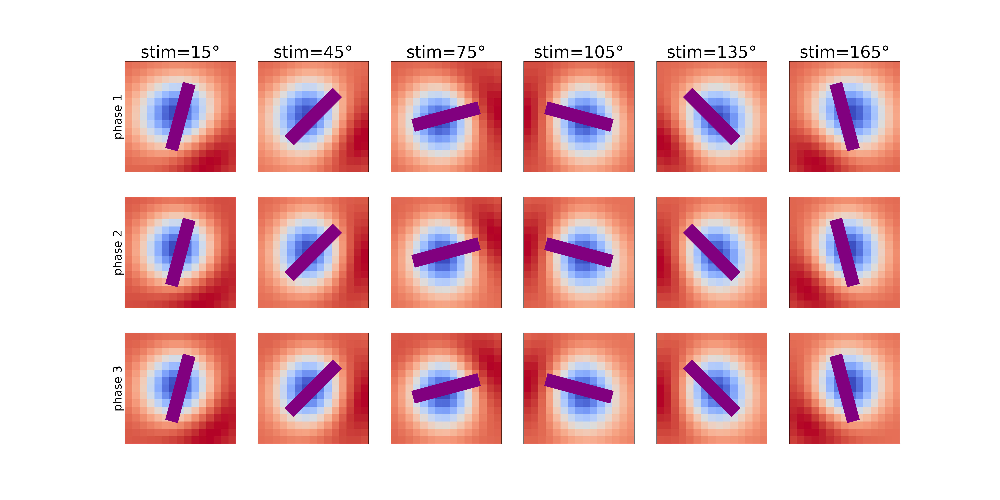
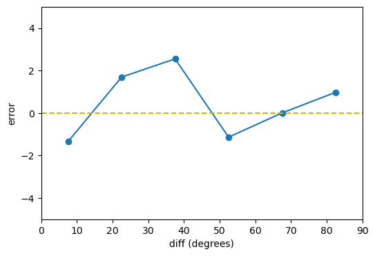
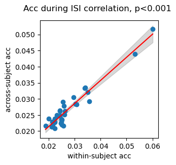
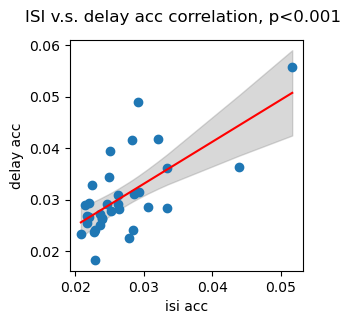

## Methods

    

        <b>Click, Certain</b>
         
    

    

        <b>Draw, Certain</b>
         
    

    

        <b>Click, Uncertain</b>
         
    

    

        <b>Draw, Uncertain</b>
         
    

## Results
### Primary results:
Previous studies have demonstrated that rich information about memoranda can be decoded from gaze patterns. This includes not only memorized features @linde-domingo_geometry_2024 but also indicators of rehearsal @de_vries_microsaccades_2024 and mental imagery of actions @heremans_eyes_2008 @daquino_eye_2023 . In this study, we found that even when memory contents were controlled and response actions were equivalent, nuances in gaze patterns were evident depending on the planned action dynamics. Specifically, gaze patterns reflect whether people were planning to draw a line or to adjust the position of dots on a circle to report the memorized orientations. 

- (Preliminary: show the heatmap of eye-gaze data under different conditions)
<figure style="text-align: center;">
    <caption><strong>Mean Gaze Location</strong></caption>
    

        <figure style="margin: 10px; text-align: center;">
            <figcaption>ISI</figcaption>
            
        </figure>
        <figure style="margin: 10px; text-align: center;">
            <figcaption>delay</figcaption>
            
        </figure>
    

    <figcaption style="margin-top: 10px;">Average mean locations during ISI/delay for each group of grating patches. Each bar: orientation representing the orientation of the gratings, location for the average gaze locations. Gray dot: the averge gaze locations from the start till end of the experiment.</figcaption>
</figure>

<figure style="text-align: center;">
    <caption><strong>Distiburiton of Off-Angle of Gaze</strong></caption>
    

        <figure style="margin: 10px; text-align: center;">
            <figcaption>ISI</figcaption>
            
        </figure>
    

    

        <figure style="margin: 10px; text-align: center;">
            <figcaption>delay</figcaption>
            
        </figure>
    

    <figcaption style="margin-top: 10px;">Average distribution of off-angle of gaze during ISI/delay, as a function of stimuli. Red for above the baseline, blue for the below</figcaption>
</figure>

<figure style="text-align: center;">
    <caption><strong>2D heatmap of distribution of Gaze</strong></caption>
    

        <figure style="margin: 10px; text-align: center;">
            <figcaption>ISI</figcaption>
            
        </figure>
    

    

        <figure style="margin: 10px; text-align: center;">
            <figcaption>delay</figcaption>
            
        </figure>
    

    <figcaption style="margin-top: 10px;">Average 2D heatmap of distribution of gaze during ISI/delay, as a function of stimuli.</figcaption>
</figure>

#### Clicking Elicits More Coherent and Feature-Corresponding Gaze Patterns Than Drawing

##### MVPA result

<figure style="text-align: center;">
    <caption><strong>MVPA: compare draw & click</strong></caption>
    

        <figure style="margin: 10px; text-align: center;">
            <figcaption>within subject (ISI)</figcaption>
            
        </figure>
        <figure style="margin: 10px; text-align: center;">
            <figcaption>across subject (ISI)</figcaption>
            
        </figure>
    

</figure>

(reason we are not during this for the delay: not enough data)

##### RSA result
<figure style="text-align: center;">
    <caption><strong>RSA: compare draw & click</strong></caption>
    

        <figure style="margin: 10px; text-align: center;">
            <figcaption>mean gaze location</figcaption>
            
        </figure>
    

    

        <figure style="margin: 10px; text-align: center;">
            <figcaption>angle distribution</figcaption>
            
        </figure>
    

</figure>

#### A Probable Trade-Off Between Motor Execution and VWM Content Layout Based on Action Demands

##### Hand motion relevance analysis
##### (TBD) regression between hand motion and gaze accuracy
- subject wise
- trial wise

### Beyond Primary Findings: Additional Insights from Gaze Patterns

#### Gaze Patterns Reflect Certainty and Effort in Action Rehearsal
Eye gaze patterns not only indicate certainty about action outcomes but may also reflect the effort invested in rehearsal, suggesting that people adjust rehearsal intensity based on action certainty and the varying costs of rehearsal across response modalities.

##### Cued v.s. Uncued
- RSA results
<figure style="text-align: center;">
    <caption><strong>RSA: compare certain v.s. uncertain</strong></caption>
    

        <figure style="margin: 10px; text-align: center;">
            <figcaption>mean gaze location</figcaption>
            
        </figure>
    

    

        <figure style="margin: 10px; text-align: center;">
            <figcaption>angle distribution</figcaption>
            
        </figure>
    

</figure>

- MVPA results
- relevance results
##### Same analysis for hand motions

#### Gaze Tracks the Development of serial bias over the delay

##### The gradual accumulation of serial biases
- MVPA results
<figure style="text-align: center;">
    <caption><strong>Serial Dependence curve (whole delay)</strong></caption>
    

        <figure style="margin: 10px; text-align: center;">
            
        </figure>
    

</figure>

- Indirect RSA evidence
<figure style="text-align: center;">
    <caption><strong>RSA: compare small, mid, large SD difference</strong></caption>
    

        <figure style="margin: 10px; text-align: center;">
            <figcaption>mean gaze location</figcaption>
            
        </figure>
    

    

        <figure style="margin: 10px; text-align: center;">
            <figcaption>angle distribution</figcaption>
            
        </figure>
    

</figure>

#### Gaze Provides a Measure for the Oscillatory Rehearsal of Multiple Items
When multiple items are remembered, they are rehearsed in a rhythmic manner. Gaze data procide a straightforward and relatively way to investigate such oscillatory process. The result suggests that even the memoranda are controlled, responsemodality will systematically affect the dynamics of this process

##### General Frequency Analysis Results

<figure style="text-align: center;">
    <caption><strong>Frequency analysis: compare draw v.s. click</strong></caption>
    

        <figure style="margin: 10px; text-align: center;">
            <figcaption>draw</figcaption>
            
        </figure>
        <figure style="margin: 10px; text-align: center;">
            <figcaption>click</figcaption>
            
        </figure>
    

</figure>

##### How the rivalry between concurrent memory morph over time
- frequency change
- development of repulsive biases
- other factors controling the process

## Supplementary

### The generalizability across subjects and phases

<figure style="text-align: center;">
    <caption><strong>correlation of acc</strong></caption>
    

        <figure style="margin: 10px; text-align: center;">
            <figcaption>within v.s. across subjects</figcaption>
            
        </figure>
        <figure style="margin: 10px; text-align: center;">
            <figcaption>across subject ISI v.s. delay</figcaption>
            
        </figure>
    

</figure>

### Individual differences

## References