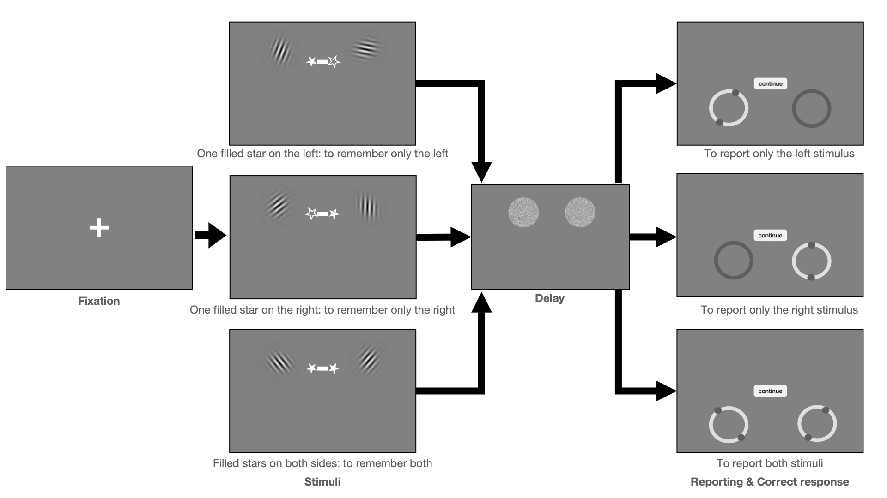
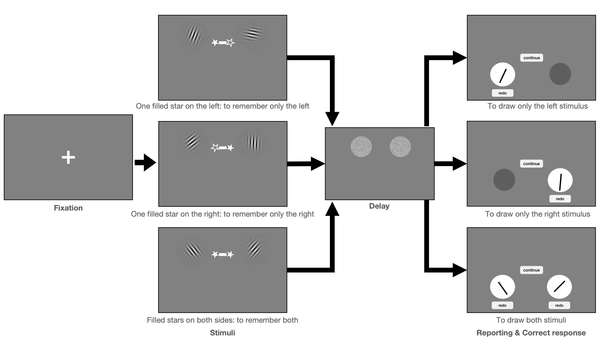
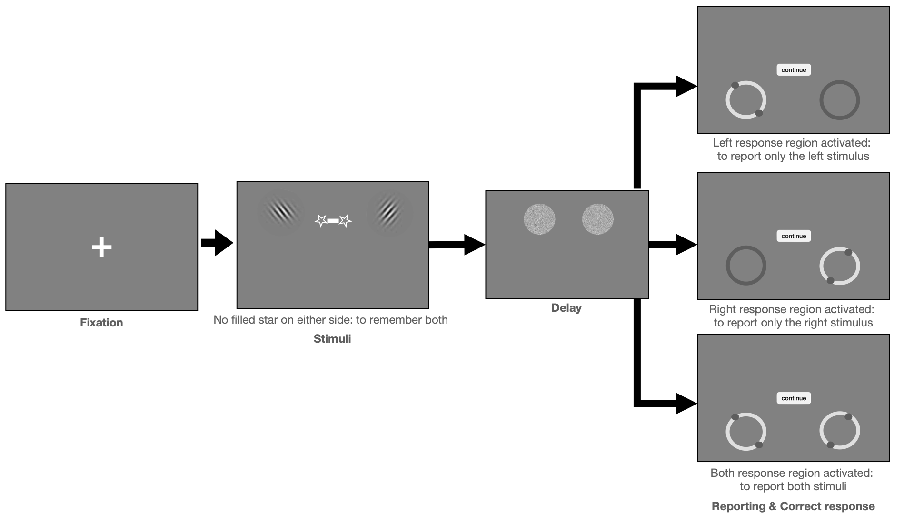
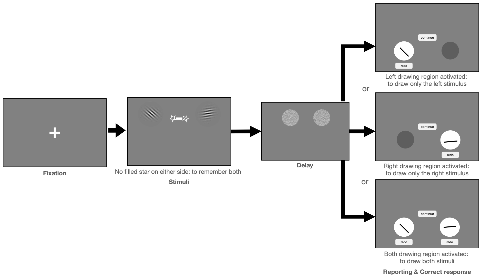

## Methods

    

        <b>Click, Certain</b>
         
    

    

        <b>Draw, Certain</b>
         
    

    

        <b>Click, Uncertain</b>
         
    

    

        <b>Draw, Uncertain</b>
         
    

## Results
### Primary results:
Previous studies have demonstrated that rich information about memoranda can be decoded from gaze patterns. This includes not only memorized features @linde-domingo_geometry_2024 but also indicators of rehearsal @de_vries_microsaccades_2024 and mental imagery of actions @heremans_eyes_2008 @daquino_eye_2023 . In this study, we found that even when memory contents were controlled and response actions were equivalent, nuances in gaze patterns were evident depending on the planned action dynamics. Specifically, gaze patterns reflect whether people were planning to draw a line or to adjust the position of dots on a circle to report the memorized orientations. 

#### Clicking Elicits More Coherent and Feature-Corresponding Gaze Patterns Than Drawing

##### MVPA result
##### RSA result

#### A Probable Trade-Off Between Motor Execution and VWM Content Layout Based on Action Demands

##### Hand motion relevance analysis
##### (TBD) regression between hand motion and gaze accuracy
- subject wise
- trial wise

### Beyond Primary Findings: Additional Insights from Gaze Patterns

#### Gaze Patterns Reflect Certainty and Effort in Action Rehearsal
Eye gaze patterns not only indicate certainty about action outcomes but may also reflect the effort invested in rehearsal, suggesting that people adjust rehearsal intensity based on action certainty and the varying costs of rehearsal across response modalities.

##### Cued v.s. Uncued
- RSA results
- MVAP results
- relevance results
##### Same analysis for hand motions

#### Gaze Tracks the Development of serial bias over the delay

##### The gradual accumulation of serial biases
- MVAP results
- Indirect RSA evidence

#### Gaze Provides a Measure for the Oscillatory Rehearsal of Multiple Items
When multiple items are remembered, they are rehearsed in a rhythmic manner. Gaze data procide a straightforward and relatively way to investigate such oscillatory process. The result suggests that even the memoranda are controlled, responsemodality will systematically affect the dynamics of this process

##### General Frequency Analysis Results
##### How the rivalry between concurrent memory morph over time
- frequency change
- development of repulsive biases
- other factors controling the process

## References