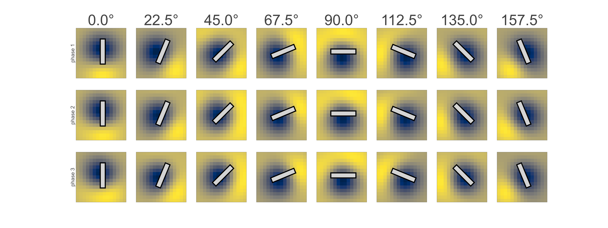
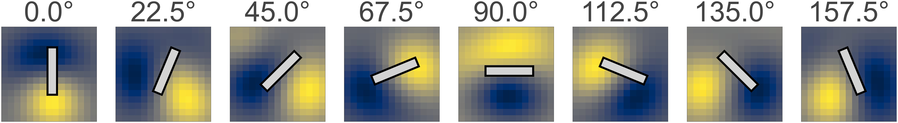
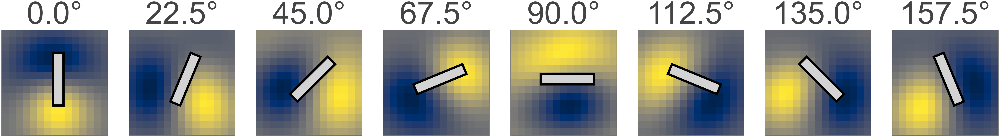
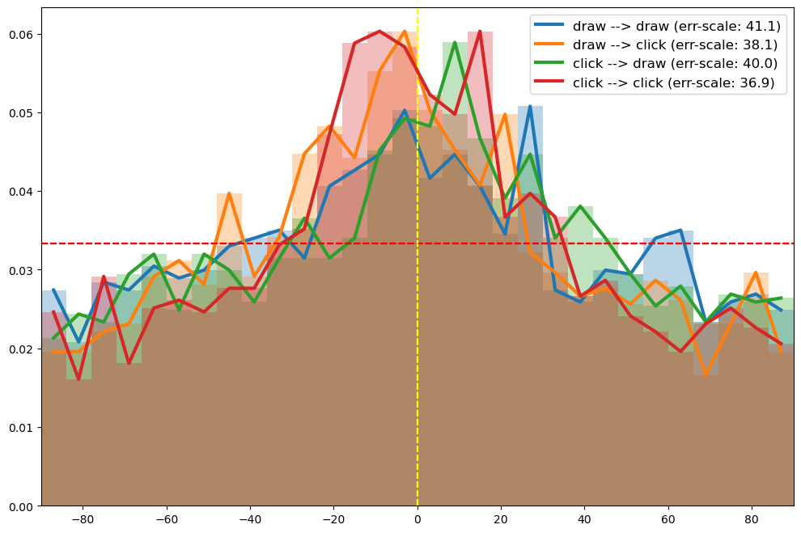

## Methods

    

        <figure style="margin: 8px; text-align: center;">
            <figcaption><strong>Click Certain</strong></figcaption>
            
        </figure>
        <figure style="margin: 8px; text-align: center;">
            <figcaption><strong>Draw Certain</strong></figcaption>
            
        </figure>
    

    

        <figure style="margin: 8px; text-align: center;">
            <figcaption><strong>Click Uncertain</strong></figcaption>
            
        </figure>
        <figure style="margin: 8px; text-align: center;">
            <figcaption><strong>Draw Uncertain</strong></figcaption>
            
        </figure>
    

## Results
### Primary results:

#### Behavioral data

 *TODO*: compare how click and draw differ: clicking is general less biased but drawing is more stable.

 *TODO*: firstly, memoranda is decodeable from eye-gaze, regardless of modes. (Show that the accuracy is above chance-level)

Note that the pattern is (1) generalizable across subjects
(2) generalizable across phases.

<figure style="text-align: center;">
    <caption><strong>correlation of acc</strong></caption>
    

        <figure style="margin: 8px; text-align: center;">
            <figcaption>within v.s. across subjects</figcaption>
            
        </figure>
        <figure style="margin: 8px; text-align: center;">
            <figcaption>across subject ISI v.s. delay</figcaption>
            
        </figure>
    

</figure>

Previous studies have demonstrated that rich information about memoranda can be decoded from gaze patterns. This includes not only memorized features @linde-domingo_geometry_2024 but also indicators of rehearsal @de_vries_microsaccades_2024 and mental imagery of actions @heremans_eyes_2008 @daquino_eye_2023 . In this study, we found that even when memory contents were controlled and response actions were equivalent, nuances in gaze patterns were evident depending on the planned action dynamics. Specifically, gaze patterns reflect whether people were planning to draw a line or to adjust the position of dots on a circle to report the memorized orientations. 

- (Preliminary: show the heatmap of eye-gaze data under different conditions)
<figure style="text-align: center;">
    <caption><strong>Mean Gaze Location</strong></caption>
    

        <figure style="margin: 10px; text-align: center;">
            <figcaption>ISI</figcaption>
            
        </figure>
        <figure style="margin: 10px; text-align: center;">
            <figcaption>delay</figcaption>
            
        </figure>
    

    <figcaption style="margin-top: 10px;">Average mean locations during ISI/delay for each group of grating patches. Each bar: orientation representing the orientation of the gratings, location for the average gaze locations. Gray dot: the averge gaze locations from the start till end of the experiment.</figcaption>
</figure>

<figure style="text-align: center;">
    <caption><strong>Distiburiton of Off-Angle of Gaze</strong></caption>
    

        <figure style="margin: 10px; text-align: center;">
            <figcaption>ISI</figcaption>
            
        </figure>
    

    

        <figure style="margin: 10px; text-align: center;">
            <figcaption>delay</figcaption>
            
        </figure>
    

    <figcaption style="margin-top: 10px;">Average distribution of off-angle of gaze during ISI/delay, as a function of stimuli. Red for above the baseline, blue for the below</figcaption>
</figure>

<figure style="text-align: center;">
    <caption><strong>2D heatmap of distribution of Gaze</strong></caption>
    

        <figure style="margin: 10px; text-align: center;">
            <figcaption>ISI</figcaption>
            
        </figure>
    

    

        <figure style="margin: 10px; text-align: center;">
            <figcaption>delay</figcaption>
            
        </figure>
    

    <figcaption style="margin-top: 10px;">Average 2D heatmap of distribution of gaze during ISI/delay, as a function of stimuli.</figcaption>
</figure>

#### Clicking Elicits More Coherent and Feature-Corresponding Gaze Patterns Than Drawing

##### Behavioral results:

##### Gaze patterns: compare the gaze distribution from drawing and clicking
For example, for x=10 v.s. x=30 or x=50 v.s. x=70 we see much distinct patterns in clicking than in drawing --> drawing tend to 'group' similar actions?
<figure style="text-align: center;">
    <caption><strong>Pixel-wise normalized Heatmap of Gaze</strong></caption>
    

        <figure style="margin: 10px; text-align: center;">
            <figcaption>From clicking</figcaption>
            
        </figure>
    

    

        <figure style="margin: 10px; text-align: center;">
            <figcaption>From drawing</figcaption>
            
        </figure>
    

    <figcaption style="margin-top: 10px;">Average 2D heatmap of distribution of gaze during the delay, as a function of stimuli.</figcaption>
</figure>

##### Further analysis of the gaze patterns
- Inverted Encoding: 
    - The predicted distribution of gaze (compared with the actual 2d heatmaps shown above)
    <figure style="text-align: center;">
        <caption><strong>Pixel-wise normalized Heatmap of Gaze</strong></caption>
        

            <figure style="margin: 10px; text-align: center;">
                <figcaption>Actual</figcaption>
                
            </figure>
        

        

            <figure style="margin: 10px; text-align: center;">
                <figcaption>Reconstructed</figcaption>
                
            </figure>
        

        <figcaption style="margin-top: 10px;">Average 2D heatmap of distribution of gaze during the delay, as a function of stimuli.</figcaption>
    </figure>

    - drawing yield worse accuracy compared to clicking
    <figure style="text-align: center;">
        <caption><strong>Inverted Decoding: compare draw & click</strong></caption>
        

            <figure style="margin: 10px; text-align: center;">
                <figcaption>Decoding Accuracy and Clockwise bias</figcaption>
                
            </figure>
        

    </figure>

- RSA results: drawing yields smaller correlation scores
    <figure style="text-align: center;">
        <caption><strong>RSA: compare draw & click</strong></caption>
        

            <figure style="margin: 10px; text-align: center;">
                <figcaption>mean gaze location</figcaption>
                
            </figure>
        

        

            <figure style="margin: 10px; text-align: center;">
                <figcaption>angle distribution</figcaption>
                
            </figure>
        

    </figure>

<!--
##### MVPA result

~~ *TODO* show the distributon of **signed** errors. Also consider putting distribution in one so it will be easier to interpret.~~

<figure style="text-align: center;">
    <caption><strong>MVPA: compare draw & click</strong></caption>
    

        <figure style="margin: 10px; text-align: center;">
            <figcaption>within subject (ISI)</figcaption>
            
        </figure>
        <figure style="margin: 10px; text-align: center;">
            <figcaption>across subject (ISI)</figcaption>
            
        </figure>
    

    

        <figure style="margin: 10px; text-align: center;">
            <figcaption>across subject (delay)</figcaption>
            
        </figure>
    

</figure>
-->

#### A Probable Trade-Off Between Motor Execution and VWM Content Layout Based on Action Demands

 *TODO* First of all, memoranda is also decodable from hand motions.

 *TODO* Put the comparable hand and eye analysis side by side

##### Hand motion relevance analysis
##### (TBD) regression between hand motion and gaze accuracy
- subject wise ( *TODO* both MVPA and RSA results)
- trial wise

### Beyond Primary Findings: Additional Insights from Gaze Patterns

#### Gaze Tracks the Development of serial bias over the delay

-  *TODO*: firstly, show there are biases
-  *TODO* then discuss the 'development'

##### The gradual accumulation of serial biases
- MVPA results
    - two items
    - window-size = 1.5s, step-size = 0.75s
    - train or test within the same window or across
    - using method similar to [@fischerDirectNeuralSignature2024]
    <figure style="text-align: center;">
    <caption><strong>Serial Dependence curve (whole delay)</strong></caption>
    

        <figure style="margin: 10px; text-align: center;">
            
            <figcaption>Left: within same epoch; Right: Train at t, test at t+1</figcaption>
        </figure>
    

    

        <figure style="margin: 10px; text-align: center;">
            
        </figure>
    

    

        <figure style="margin: 10px; text-align: center;">
            
        </figure>
    

</figure>

- Indirect RSA evidence

~~ *TODO*: double check the correct way of dividing groups...~~

<figure style="text-align: center;">
    <caption><strong>RSA: compare small, mid, large SD difference</strong></caption>
    

        <figure style="margin: 10px; text-align: center;">
            <figcaption>stim 1: mean gaze location</figcaption>
            
        </figure>
        <figure style="margin: 10px; text-align: center;">
            <figcaption>stim 1: angle distrib</figcaption>
            
        </figure>
    

    

        <figure style="margin: 10px; text-align: center;">
            <figcaption>stim 2: mean gaze location</figcaption>
            
        </figure>
        <figure style="margin: 10px; text-align: center;">
            <figcaption>stim 2: angle distrib</figcaption>
            
        </figure>
    

</figure>

-  *TODO*: also see if there are correlations between SD magnitude and gaze
    - example: do people of large RSA diffs  between small and large SD. show greater/smaller serial bias magnitude?

#### Gaze Patterns Reflect Certainty and Effort in Action Rehearsal
Eye gaze patterns not only indicate certainty about action outcomes but may also reflect the effort invested in rehearsal, suggesting that people adjust rehearsal intensity based on action certainty and the varying costs of rehearsal across response modalities.

##### Cued v.s. Uncued
- RSA results
<figure style="text-align: center;">
    <caption><strong>RSA: compare certain v.s. uncertain</strong></caption>
    

        <figure style="margin: 10px; text-align: center;">
            <figcaption>mean gaze location</figcaption>
            
        </figure>
    

    

        <figure style="margin: 10px; text-align: center;">
            <figcaption>angle distribution</figcaption>
            
        </figure>
    

</figure>

- MVPA results
- relevance results
##### Same analysis for hand motions

#### Gaze Provides a Measure for the Oscillatory Rehearsal of Multiple Items
When multiple items are remembered, they are rehearsed in a rhythmic manner. Gaze data procide a straightforward and relatively way to investigate such oscillatory process. The result suggests that even the memoranda are controlled, responsemodality will systematically affect the dynamics of this process

##### General Frequency Analysis Results

<figure style="text-align: center;">
    <caption><strong>Frequency analysis: compare draw v.s. click</strong></caption>
    

        <figure style="margin: 10px; text-align: center;">
            <figcaption>draw</figcaption>
            
        </figure>
        <figure style="margin: 10px; text-align: center;">
            <figcaption>click</figcaption>
            
        </figure>
    

</figure>

-  *TODO*: what are those clusters: within or across subjects?

##### How the rivalry between concurrent memory morph over time
- frequency change
- development of repulsive biases
- other factors controling the process

## Supplementary

### Individual differences

## References