

## Methods

    

        <figure style="margin: 8px; text-align: center;">
            <figcaption><strong>Click Certain</strong></figcaption>
            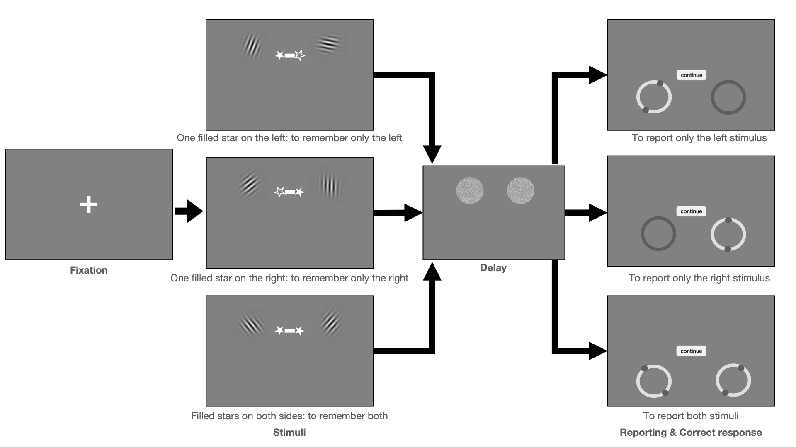
        </figure>
        <figure style="margin: 8px; text-align: center;">
            <figcaption><strong>Draw Certain</strong></figcaption>
            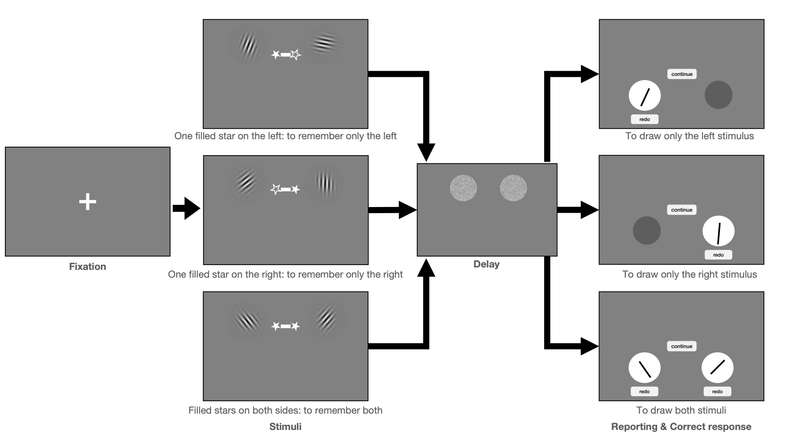
        </figure>
    

    

        <figure style="margin: 8px; text-align: center;">
            <figcaption><strong>Click Uncertain</strong></figcaption>
            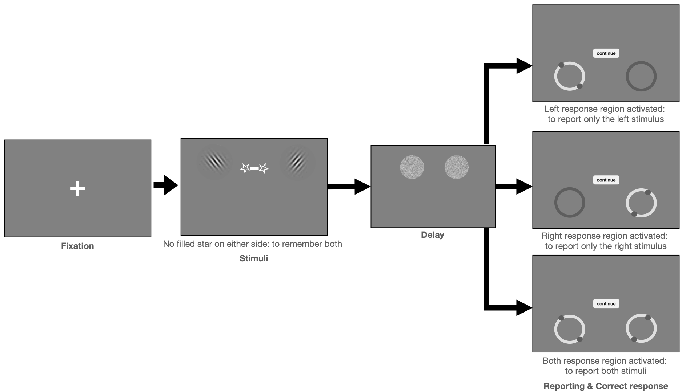
        </figure>
        <figure style="margin: 8px; text-align: center;">
            <figcaption><strong>Draw Uncertain</strong></figcaption>
            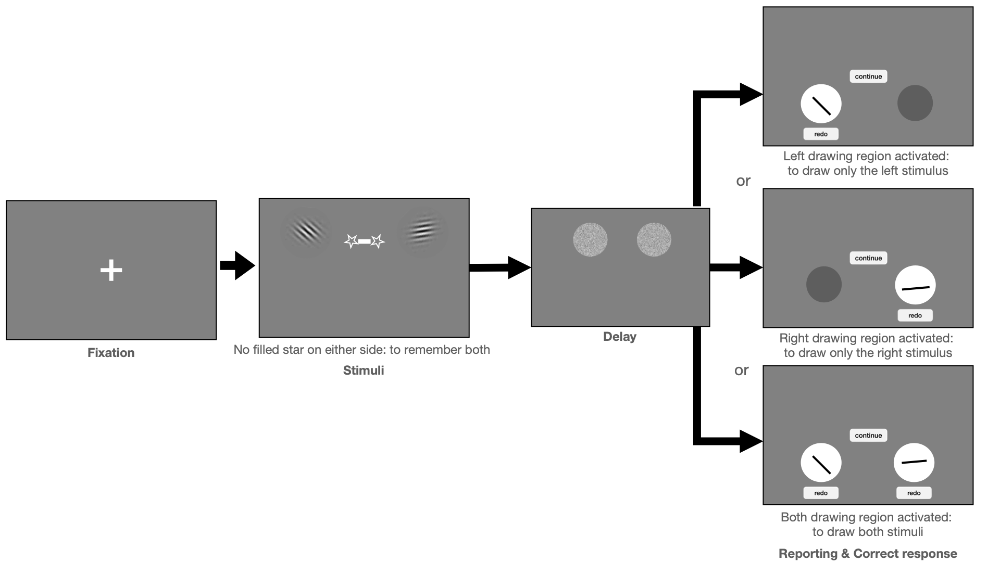
        </figure>
    

## Results

### The memoranda is decodable from eye-gaze during ISI and delay, with patterns shared across subjects and expected output format.

- Gaze pattern is feature-specific -- starting from the later encoding stage. 
    - Tested within subject
        <figure style="text-align: center;">
            <caption><strong>Decoding Accuracy (Within Subjects) </strong></caption>
            

                <figure style="margin: 8px; text-align: center;">
                    <figcaption><strong> Before Cue Onest </strong></figcaption>
                    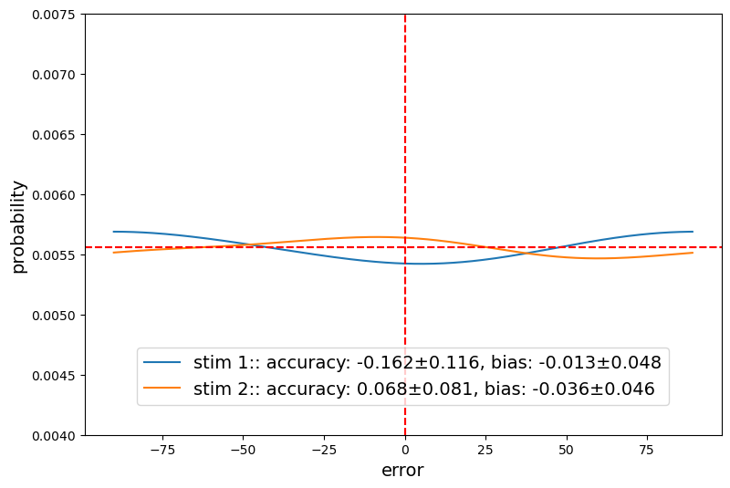
                </figure>
                <figure style="margin: 8px; text-align: center;">
                    <figcaption><strong> During Cue Onest </strong></figcaption>
                    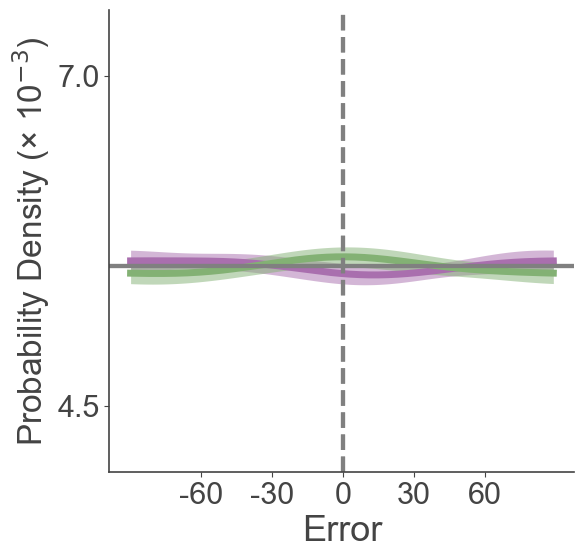
                </figure>
                <figure style="margin: 8px; text-align: center;">
                    <figcaption><strong> After Cue Onset </strong></figcaption>
                    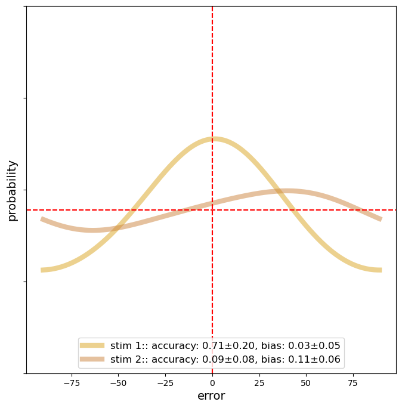
                </figure>
                <figure style="margin: 8px; text-align: center;">
                    <figcaption><strong> ISI </strong></figcaption>
                    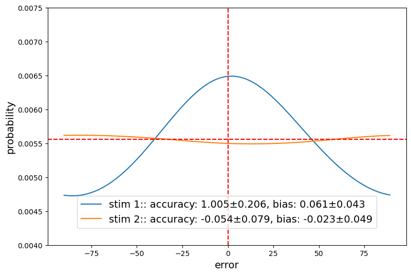
                </figure>
                <figure style="margin: 8px; text-align: center;">
                    <figcaption><strong> Delay </strong></figcaption>
                    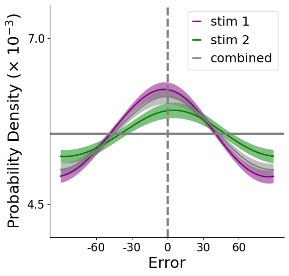
                </figure>
            

        </figure>

    - Such pattern generalize across subjects
        - features extracted
            <figure style="text-align: center;">
                <caption><strong>Gaze Features (Encoding, before cue-onset)</strong></caption>
                

                    <figure style="margin: 4px; text-align: center;">
                        <figcaption>Mean Gaze</figcaption>
                        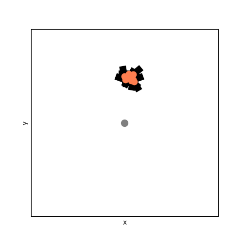
                    </figure>
                    

                    

                    <figure style="margin: 1px; text-align: center;">
                        <figcaption>Angle Distribution</figcaption>
                        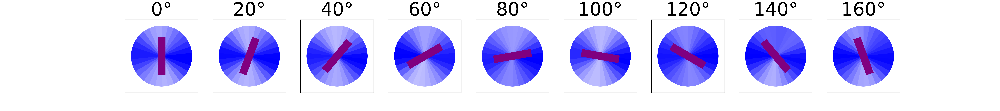
                    </figure>
                    

                    

                    <figure style="margin: 1px; text-align: center;">
                        <figcaption>Heat Map</figcaption>
                        
                    </figure>
                    

                    

                

            </figure>
            <figure style="text-align: center;">
                <caption><strong>Gaze Features (Encoding, after cue-onset)</strong></caption>
                

                    <figure style="margin: 4px; text-align: center;">
                        <figcaption>Mean Gaze</figcaption>
                        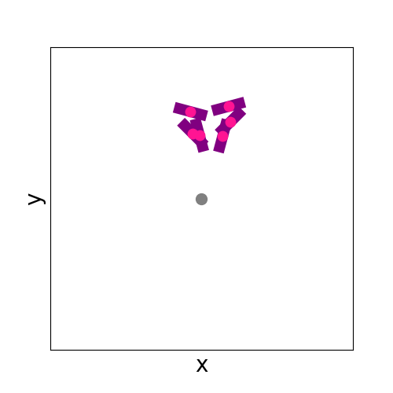
                    </figure>
                    

                    

                    <figure style="margin: 1px; text-align: center;">
                        <figcaption>Angle Distribution</figcaption>
                        
                    </figure>
                    

                    

                     <figure style="margin: 1px; text-align: center;">
                        <figcaption>Heat Map</figcaption>
                        
                    </figure>
                    

                    

                

            </figure>
            <figure style="text-align: center;">
                <caption><strong>Gaze Features (During ISI)</strong></caption>
                

                    <figure style="margin: 4px; text-align: center;">
                        <figcaption>Mean Gaze</figcaption>
                        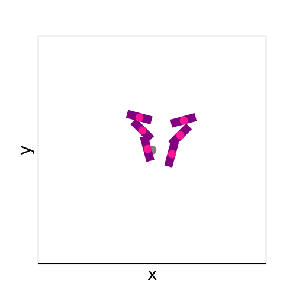
                    </figure>
                    

                    

                    <figure style="margin: 1px; text-align: center;">
                        <figcaption>Angle Distribution</figcaption>
                        
                    </figure>
                    

                    

                     <figure style="margin: 1px; text-align: center;">
                        <figcaption>Heat Map</figcaption>
                        
                    </figure>
                    

                    

                

            </figure>
            <figure style="text-align: center;">
                <caption><strong>Gaze Features (During Delay)</strong></caption>
                

                    <figure style="margin: 4px; text-align: center;">
                        <figcaption>Mean Gaze</figcaption>
                        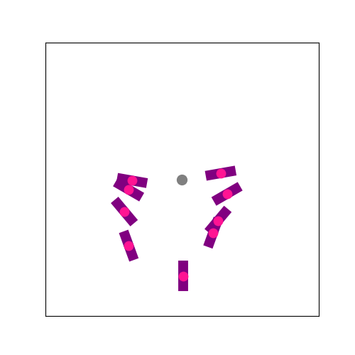
                    </figure>
                    

                    

                    <figure style="margin: 1px; text-align: center;">
                        <figcaption>Angle Distribution</figcaption>
                        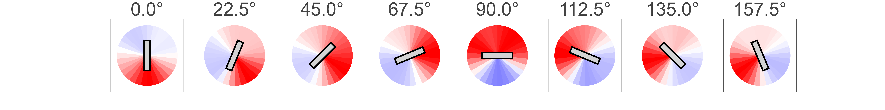
                    </figure>
                    

                    

                     <figure style="margin: 1px; text-align: center;">
                        <figcaption>Heat Map</figcaption>
                        
                    </figure>
                    

                    

                

            </figure>

        - inverted encoding result
        <figure style="text-align: center;">
            <caption><strong>Decoding Accuracy (Across Subjects) </strong></caption>
            

                <figure style="margin: 8px; text-align: center;">
                    <figcaption><strong> Before Cue Onest </strong></figcaption>
                    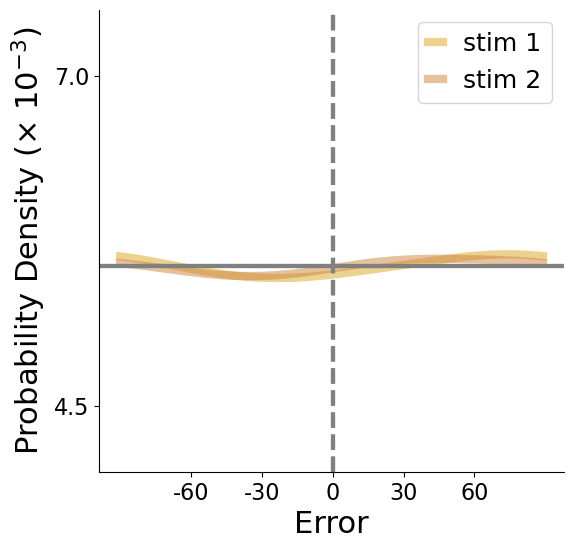
                </figure>
                <figure style="margin: 8px; text-align: center;">
                    <figcaption><strong> During Cue Onest </strong></figcaption>
                    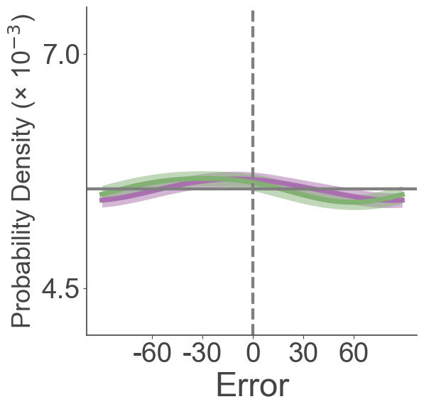
                </figure>
                <figure style="margin: 8px; text-align: center;">
                    <figcaption><strong> After Cue Onset </strong></figcaption>
                    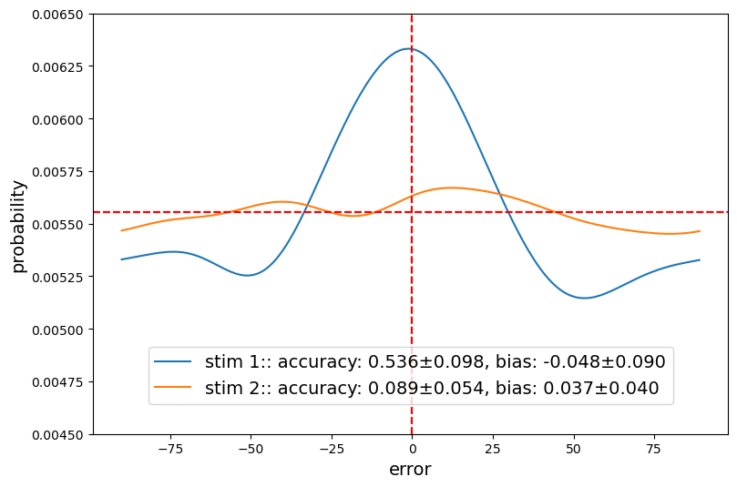
                </figure>
                <figure style="margin: 8px; text-align: center;">
                    <figcaption><strong> ISI </strong></figcaption>
                    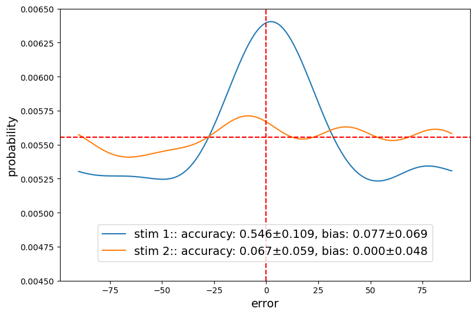
                </figure>
                <figure style="margin: 8px; text-align: center;">
                    <figcaption><strong> Delat </strong></figcaption>
                    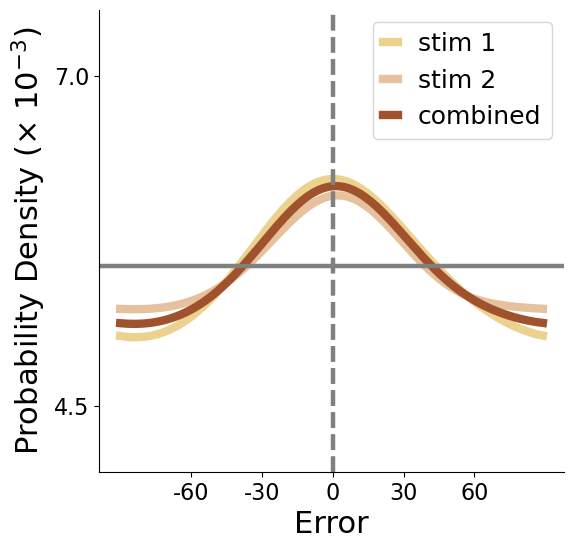
                </figure>
            

        </figure>

- More importantly, the late-encoding pattern generalizes to ISI and delay; the pattern is shared both within and across subjects.

    - within subjects:
        <figure style="text-align: center;">
            <caption><strong>Decoding Accuracy (Within Subjects)</strong></caption>
            

                <figure style="margin: 8px; text-align: center;">
                    <figcaption><strong> Encoding -> ISI </strong></figcaption>
                    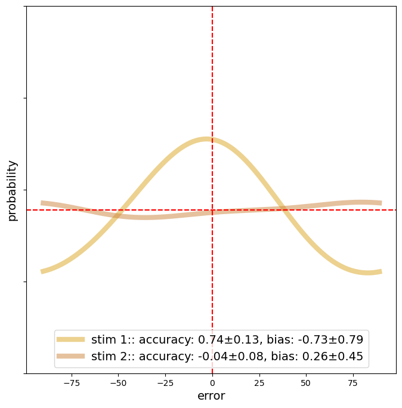
                </figure>
                <figure style="margin: 8px; text-align: center;">
                    <figcaption><strong> Encoding -> Delay </strong></figcaption>
                    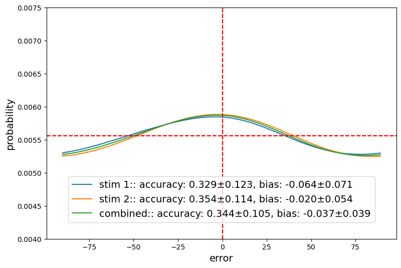
                </figure>
                <figure style="margin: 8px; text-align: center;">
                    <figcaption><strong> Encoding -> ISI </strong></figcaption>
                    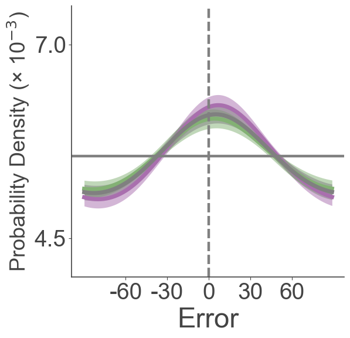
                </figure>
            

        </figure>

    - across subjects
        - inverted encoding results
            <figure style="text-align: center;">
                <caption><strong>Decoding Accuracy (Across Subjects)</strong></caption>
                

                    <figure style="margin: 8px; text-align: center;">
                        <figcaption><strong> Encoding -> ISI </strong></figcaption>
                        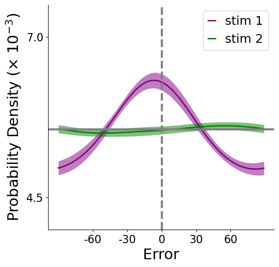
                    </figure>
                    <figure style="margin: 8px; text-align: center;">
                        <figcaption><strong> Encoding -> Delay </strong></figcaption>
                        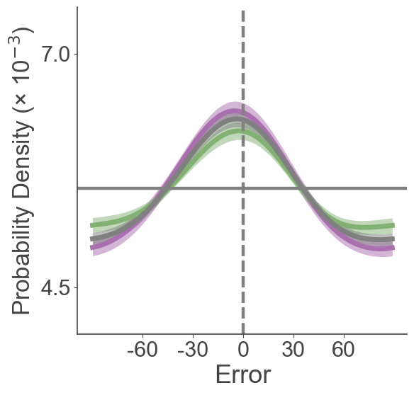
                    </figure>
                    <figure style="margin: 8px; text-align: center;">
                        <figcaption><strong> ISI -> Delay </strong></figcaption>
                        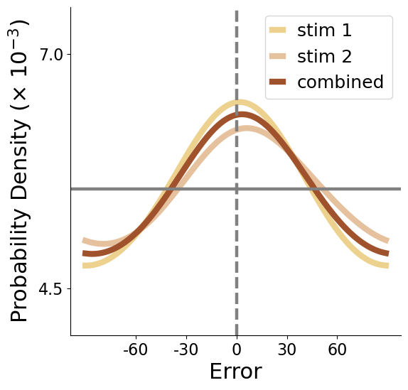
                    </figure>
                

            </figure>

- Also, the decoding accuracy correlate between within and across subjects (both $p < 0.0001$)
    <figure style="text-align: center;">
        <caption><strong>correlation of decoding accuracy</strong></caption>
        

            <figure style="margin: 8px; text-align: center;">
                <figcaption>encoding</figcaption>
                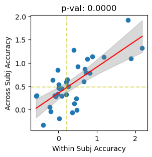
            </figure>
            <figure style="margin: 8px; text-align: center;">
                <figcaption>ISI</figcaption>
                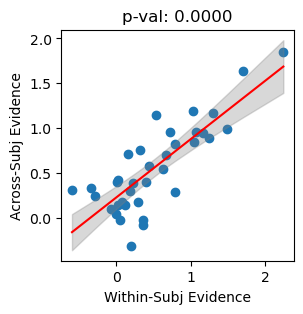
            </figure>
            <figure style="margin: 8px; text-align: center;">
                <figcaption>delay</figcaption>
                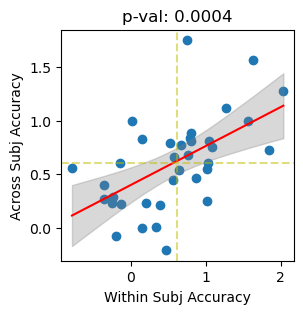
            </figure>
        

    </figure>

- There are good generalizability across phases.
    - subject level analysis:
        - Check if there are correlation between gaze decodability and behavior performance. 

        <figure style="text-align: center;">
            <caption><strong>Gaze Decodability v.s. Behavioral Accuracy </strong></caption>
            

                <figure style="margin: 8px; text-align: center;">
                    <figcaption><strong> Encoding </strong></figcaption>
                    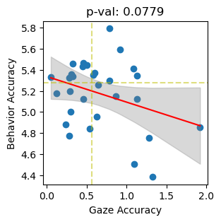
                </figure>
                <figure style="margin: 8px; text-align: center;">
                    <figcaption><strong> Enc -> ISI </strong></figcaption>
                    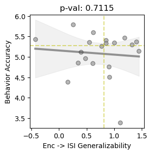
                </figure>
                <figure style="margin: 8px; text-align: center;">
                    <figcaption><strong> ISI </strong></figcaption>
                    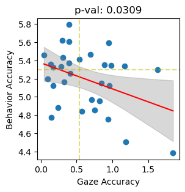
                </figure>
                <figure style="margin: 8px; text-align: center;">
                    <figcaption><strong>  ISI -> Delay </strong></figcaption>
                    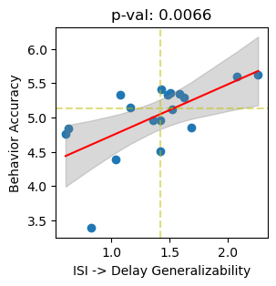
                </figure>
                <figure style="margin: 8px; text-align: center;">
                    <figcaption><strong> Delay </strong></figcaption>
                    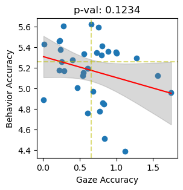
            

        </figure>
                TODO To compute the genaralizability the cutoff i use is quite arbitrary?
        
        - Check whether the accuracy at different phases correlate: if someone's gaze is more trackable during a certain phase, is their gaze is more trackable overall. And do these accuracy correlate with the generalizability from one phase to another? 

        <figure style="text-align: center;">
            <caption><strong>Correlatrion between Gaze Decodability </strong></caption>
            

                <figure style="margin: 8px; text-align: center;">
                    <figcaption><strong> Enc -> Enc v.s. ISI -> ISI </strong></figcaption>
                    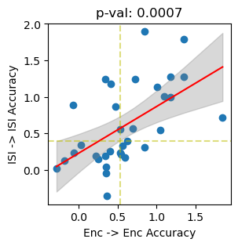
                </figure>
                <figure style="margin: 8px; text-align: center;">
                    <figcaption><strong> Enc -> Enc v.s. Enc -> ISI </strong></figcaption>
                    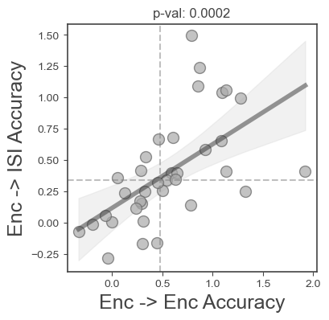
                </figure>
                <figure style="margin: 8px; text-align: center;">
                    <figcaption><strong> ISI -> ISI v.s. Enc -> ISI </strong></figcaption>
                    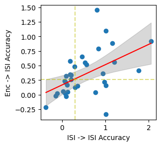
            

            

                <figure style="margin: 8px; text-align: center;">
                    <figcaption><strong> ISI -> ISI v.s. Delay -> Delay </strong></figcaption>
                    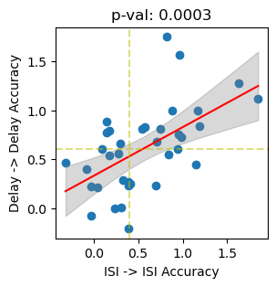
                </figure>
                <figure style="margin: 8px; text-align: center;">
                    <figcaption><strong> ISI -> ISI v.s. ISI -> Delay </strong></figcaption>
                    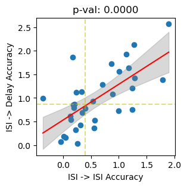
                </figure>
                <figure style="margin: 8px; text-align: center;">
                    <figcaption><strong> Delay -> Delay v.s. ISI -> Delay </strong></figcaption>
                    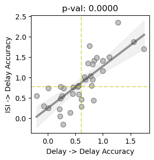
            

        </figure>

- Summary

### Hand motions:  
- The hand motion also track the memoranda (which is not surprising tho)
    <figure style="text-align: center;">
        <caption><strong>Decoding Accuracy</strong></caption>
        

            <figure style="margin: 8px; text-align: center;">
                <figcaption><strong> Encoding </strong></figcaption>
                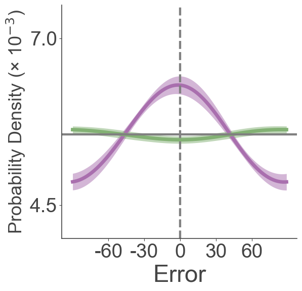
            </figure>
            <figure style="margin: 8px; text-align: center;">
                <figcaption><strong> ISI </strong></figcaption>
                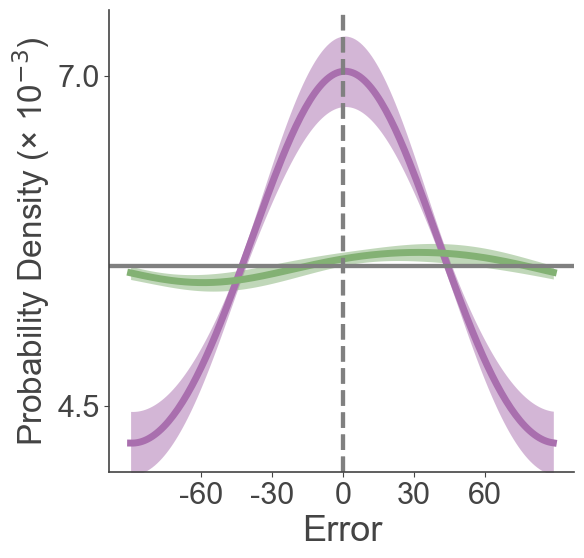
            </figure>
            <figure style="margin: 8px; text-align: center;">
                <figcaption><strong> delay </strong></figcaption>
                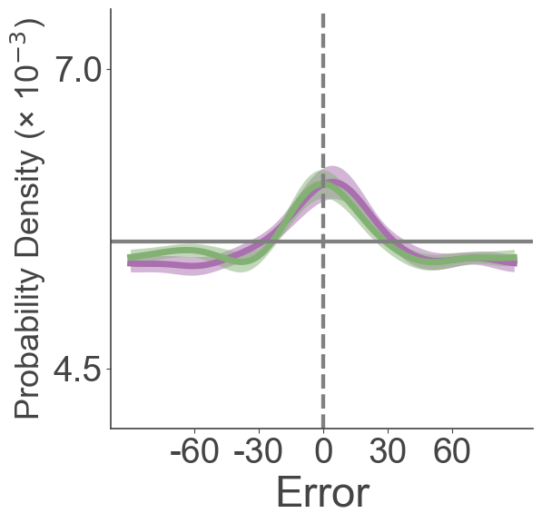
            </figure>
        

    </figure>

### Draw v.s. Click

#### Behavioral data

 *TODO*: compare how click and draw differ: clicking is general less biased but drawing is more stable.

Previous studies have demonstrated that rich information about memoranda can be decoded from gaze patterns. This includes not only memorized features @linde-domingo_geometry_2024 but also indicators of rehearsal @de_vries_microsaccades_2024 and mental imagery of actions @heremans_eyes_2008 @daquino_eye_2023 . In this study, we found that even when memory contents were controlled and response actions were equivalent, nuances in gaze patterns were evident depending on the planned action dynamics. Specifically, gaze patterns reflect whether people were planning to draw a line or to adjust the position of dots on a circle to report the memorized orientations. 

- (Preliminary: show the heatmap of eye-gaze data under different conditions)
<figure style="text-align: center;">
    <caption><strong>Mean Gaze Location</strong></caption>
    

        <figure style="margin: 10px; text-align: center;">
            <figcaption>ISI</figcaption>
            
        </figure>
        <figure style="margin: 10px; text-align: center;">
            <figcaption>delay</figcaption>
            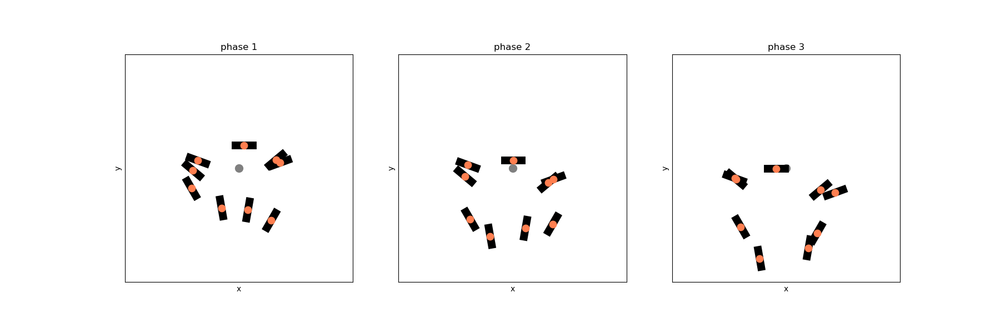
        </figure>
    

    <figcaption style="margin-top: 10px;">Average mean locations during ISI/delay for each group of grating patches. Each bar: orientation representing the orientation of the gratings, location for the average gaze locations. Gray dot: the averge gaze locations from the start till end of the experiment.</figcaption>
</figure>

<figure style="text-align: center;">
    <caption><strong>Distiburiton of Off-Angle of Gaze</strong></caption>
    

        <figure style="margin: 10px; text-align: center;">
            <figcaption>ISI</figcaption>
            
        </figure>
    

    

        <figure style="margin: 10px; text-align: center;">
            <figcaption>delay</figcaption>
            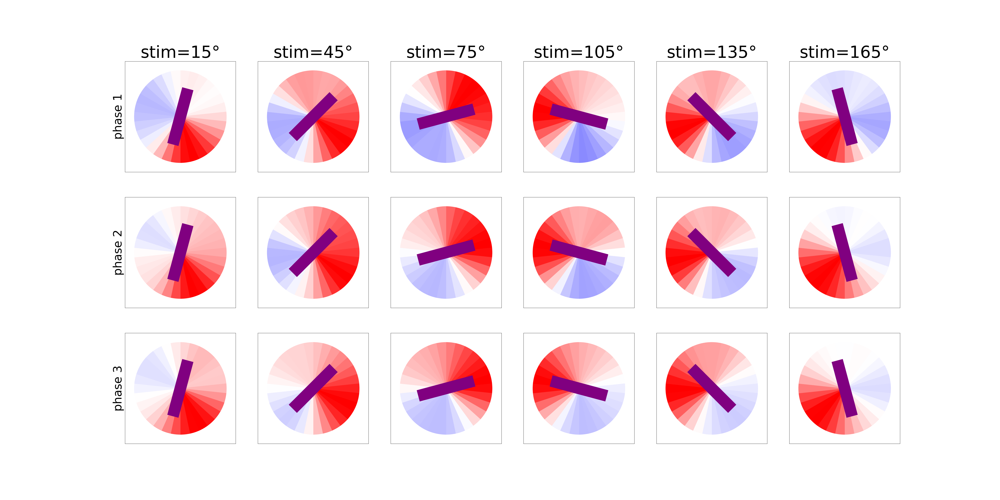
        </figure>
    

    <figcaption style="margin-top: 10px;">Average distribution of off-angle of gaze during ISI/delay, as a function of stimuli. Red for above the baseline, blue for the below</figcaption>
</figure>

<figure style="text-align: center;">
    <caption><strong>2D heatmap of distribution of Gaze</strong></caption>
    

        <figure style="margin: 10px; text-align: center;">
            <figcaption>ISI</figcaption>
            
        </figure>
    

    

        <figure style="margin: 10px; text-align: center;">
            <figcaption>delay</figcaption>
            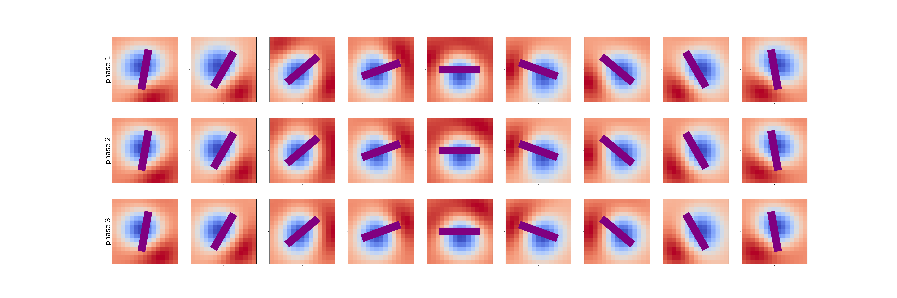
        </figure>
    

    <figcaption style="margin-top: 10px;">Average 2D heatmap of distribution of gaze during ISI/delay, as a function of stimuli.</figcaption>
</figure>

#### Clicking Elicits More Coherent and Feature-Corresponding Gaze Patterns Than Drawing

##### Behavioral results:

##### Gaze patterns: compare the gaze distribution from drawing and clicking
For example, for x=10 v.s. x=30 or x=50 v.s. x=70 we see much distinct patterns in clicking than in drawing --> drawing tend to 'group' similar actions?
<figure style="text-align: center;">
    <caption><strong>Pixel-wise normalized Heatmap of Gaze</strong></caption>
    

        <figure style="margin: 10px; text-align: center;">
            <figcaption>From clicking</figcaption>
            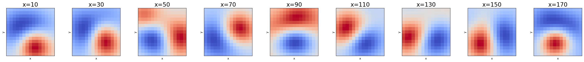
        </figure>
    

    

        <figure style="margin: 10px; text-align: center;">
            <figcaption>From drawing</figcaption>
            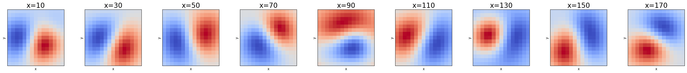
        </figure>
    

    <figcaption style="margin-top: 10px;">Average 2D heatmap of distribution of gaze during the delay, as a function of stimuli.</figcaption>
</figure>

##### Further analysis of the gaze patterns
- Inverted Encoding: 
    - drawing yield worse accuracy compared to clicking
    <figure style="text-align: center;">
        <caption><strong>Inverted Decoding: compare draw & click</strong></caption>
        

            <figure style="margin: 10px; text-align: center;">
                <figcaption>Decoding Accuracy and Clockwise bias</figcaption>
                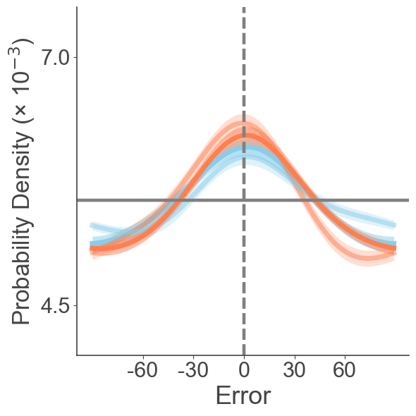
            </figure>
        

    </figure>

- RSA results: drawing yields smaller correlation scores
    <figure style="text-align: center;">
        <caption><strong>RSA: compare draw & click</strong></caption>
        

            <figure style="margin: 10px; text-align: center;">
                <figcaption>mean gaze location</figcaption>
                
            </figure>
        

        

            <figure style="margin: 10px; text-align: center;">
                <figcaption>angle distribution</figcaption>
                
            </figure>
        

    </figure>

- Question: why they have different decoding accuracy?  *TODO* FIX THIS AFTER WE RERUN THE ANALYSIS
    - Firstly, we investigate how the generalizability across modes evolves throughout the delay
    
    

        <figure style="margin: 8px; text-align: center;">
            <figcaption><strong>decoding accuracy</strong></figcaption>
            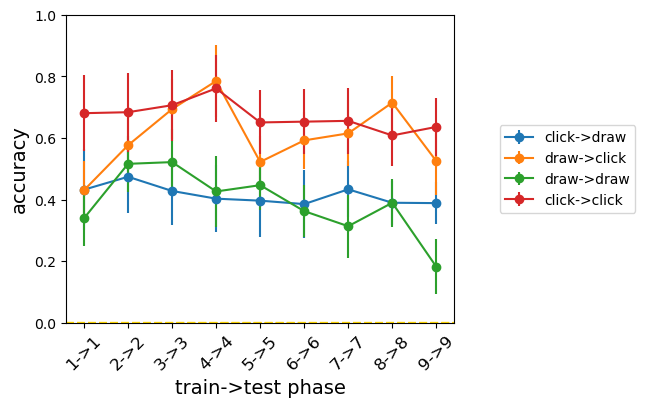
        </figure>
    

    - Next, are memory for two modes represented in a relative stable manner, or evolve throughout the delay? We check the decoding accuracy across phase (i.e. trained on an earlier phase, tested on a later phase)
    

        <figure style="margin: 8px; text-align: center;">
            <figcaption><strong>Draw</strong></figcaption>
            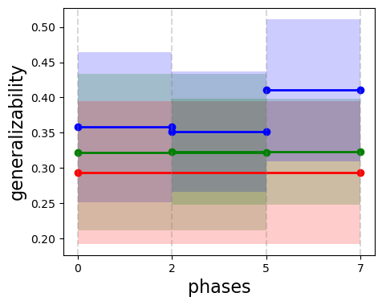
        </figure>
        <figure style="margin: 8px; text-align: center;">
            <figcaption><strong>Click</strong></figcaption>
            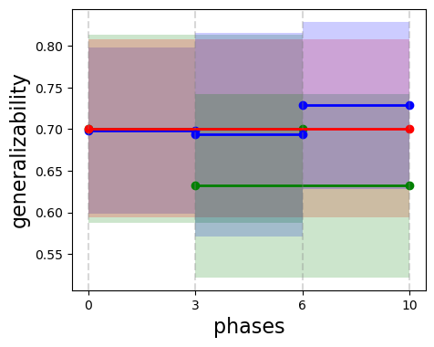
        </figure>
    

    - Discussion: overall, it seems when the mode is 'drawing', the representation 'changes' more (or go through more processing) over time. this aligns with our survey results.
        - preliminary study survey:  *TODO*
        - survey for the current study:
        <figure style="text-align: center;">
            <caption><strong>MVPA: compare draw & click</strong></caption>
            

                <figure style="margin: 10px; text-align: center;">
                    <figcaption>within subject (ISI)</figcaption>
                    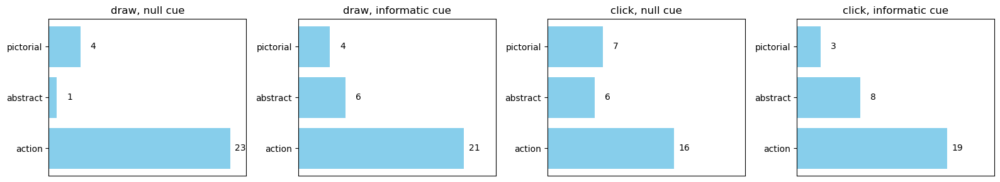
                </figure>
            

        </figure>

<!--
##### MVPA result

~~ *TODO* show the distributon of **signed** errors. Also consider putting distribution in one so it will be easier to interpret.~~

<figure style="text-align: center;">
    <caption><strong>MVPA: compare draw & click</strong></caption>
    

        <figure style="margin: 10px; text-align: center;">
            <figcaption>within subject (ISI)</figcaption>
            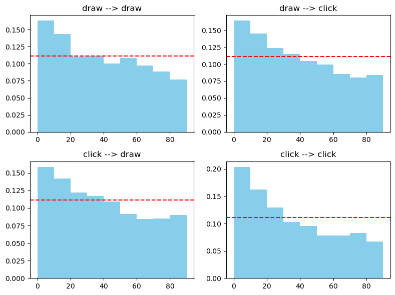
        </figure>
        <figure style="margin: 10px; text-align: center;">
            <figcaption>across subject (ISI)</figcaption>
            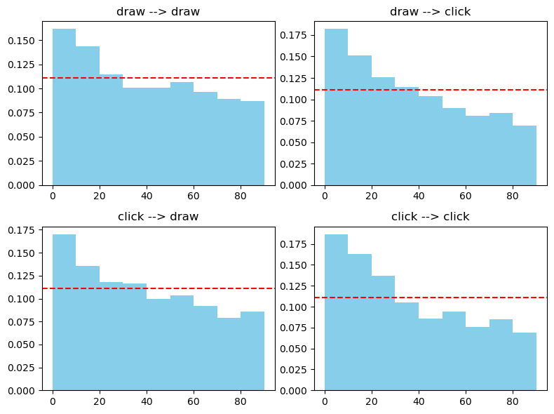
        </figure>
    

    

        <figure style="margin: 10px; text-align: center;">
            <figcaption>across subject (delay)</figcaption>
            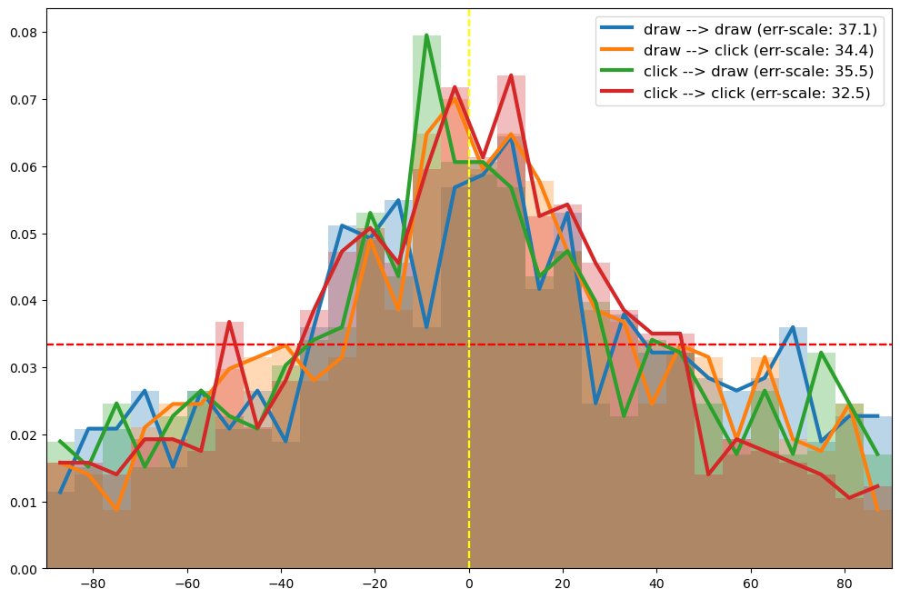
        </figure>
    

</figure>
-->

#### A Probable Trade-Off Between Motor Execution and VWM Content Layout Based on Action Demands

- Draw v.s. Click
    <figure style="text-align: center;">
        

            <figure style="margin: 10px; text-align: center;">
                <figcaption>Hand Motion Magnitude</figcaption>
                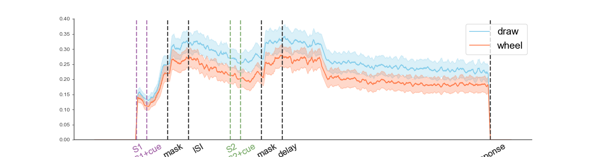
            </figure>
            <figure style="margin: 10px; text-align: center;">
                <figcaption>Hand Motion Frequency</figcaption>
                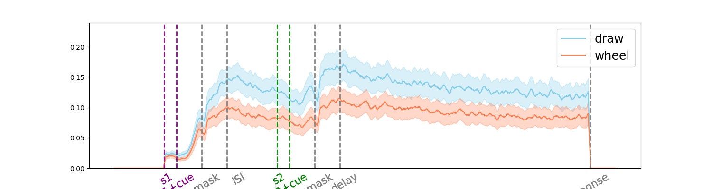
            </figure>
        

        

            <figure style="margin: 10px; text-align: center;">
                <figcaption>Inverted encoding results</figcaption>
                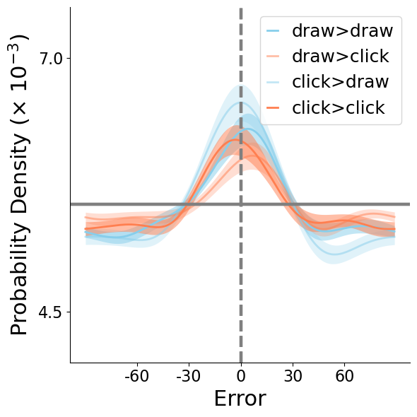
            </figure>
        

    </figure>

 *TODO* Put the comparable hand and eye analysis side by side

##### Hand motion relevance analysis
##### (TBD) regression between hand motion and gaze accuracy
- subject wise ( *TODO* both MVPA and RSA results)
- trial wise

### Beyond Primary Findings: Additional Insights from Gaze Patterns

#### Gaze Tracks the Development of serial bias over the delay

- Serial bias in behavior: not only there is serial bias, the bias is also greater in drawing than in clicking
    <figure style="text-align: center;">
        <caption><strong>Serial Dependence curve (whole delay)</strong></caption>
        

            <figure style="margin: 10px; text-align: center;">
                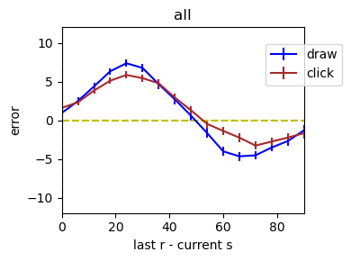
                <figcaption>Left: within same epoch; Right: Train at t, test at t+1</figcaption>
            </figure>
        

    </figure>

##### The gradual accumulation of serial biases
- MVPA results
    - two items
    - window-size = 1.5s, step-size = 0.35s
    - train or test within the same window or across
    - using method similar to [@fischerDirectNeuralSignature2024]
    <figure style="text-align: center;">
        <caption><strong>Serial Dependence curve (whole delay)</strong></caption>
        

            <figure style="margin: 10px; text-align: center;">
                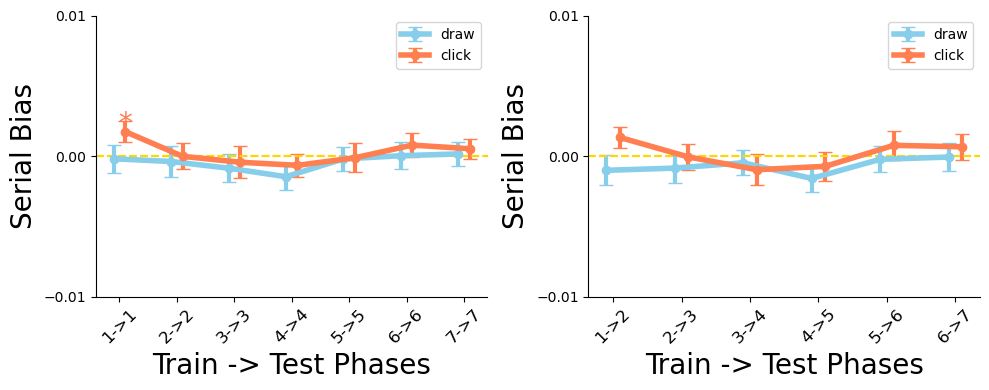
                <figcaption>Left: within same epoch; Right: Train at t, test at t+1</figcaption>
            </figure>
        

    </figure>

    - Since in the behaviors we see a smilar-attractive v.s. dissimilar-repuslive pattern, we further split the trial by the difference between target and previous response.
    <figure style="text-align: center;">
        <caption><strong>Serial Dependence curve (whole delay)</strong></caption>
        

            <figure style="margin: 10px; text-align: center;">
                <figcaption>draw</figcaption>
                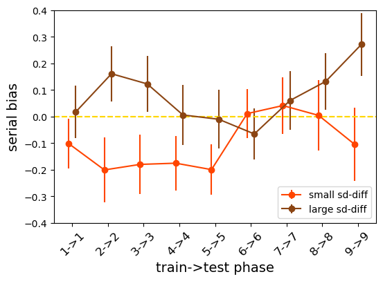
            </figure>
            <figure style="margin: 10px; text-align: center;">
                <figcaption>click</figcaption>
                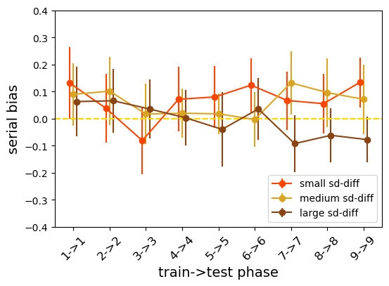
            </figure>
        

    </figure>

- Indirect RSA evidence

~~ *TODO*: double check the correct way of dividing groups...~~

<figure style="text-align: center;">
    <caption><strong>RSA: compare small, mid, large SD difference</strong></caption>
    

        <figure style="margin: 10px; text-align: center;">
            <figcaption>stim 1: mean gaze location</figcaption>
            
        </figure>
        <figure style="margin: 10px; text-align: center;">
            <figcaption>stim 1: angle distrib</figcaption>
            
        </figure>
    

    

        <figure style="margin: 10px; text-align: center;">
            <figcaption>stim 2: mean gaze location</figcaption>
            
        </figure>
        <figure style="margin: 10px; text-align: center;">
            <figcaption>stim 2: angle distrib</figcaption>
            
        </figure>
    

</figure>

- similarly we see in inverted encoding results:

    <table>
    <tr>
        <th></th>
        <th>Accuracy (Stim 1)</th>
        <th>Accuracy (Stim 2)</th>
    </tr>
    <tr>
        <td>small SD diff</td>
        <td>0.870 &plusmn 0.117</td>
        <td>0.555 &plusmn 0.161</td>
    </tr>
    <tr>
        <td>medium SD diff</td>
        <td>0.461 &plusmn 0.159</td>
        <td>0.361 &plusmn 0.124</td>
    </tr>
        <tr>
        <td>large SD diff</td>
        <td>0.537 &plusmn 0.140</td>
        <td>0.304 &plusmn 0.161</td>
    </tr>
    </table>

- also see if there are correlations between SD magnitude and gaze
    - Subject Level Analysis:
        - Question: do people of large RSA diffs  between small and large SD. show greater/smaller serial bias magnitude?  *TODO*
        - Question: do subject of larger SD decoded from gaze has larger behavior SD?
            <figure style="text-align: center;">
                <caption><strong>Behavior SD v.s. Gaze SD</strong></caption>
                

                    <figure style="margin: 10px; text-align: center;">
                        <figcaption>Draw</figcaption>
                        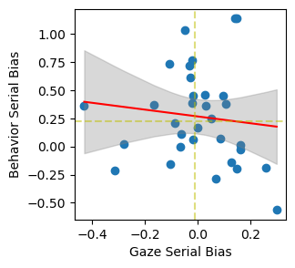
                    </figure>
                    <figure style="margin: 10px; text-align: center;">
                        <figcaption>Click</figcaption>
                        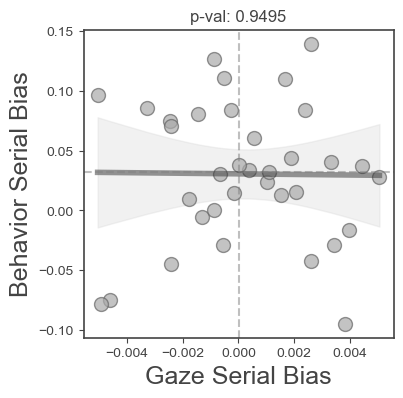
                    </figure>
                

            </figure>
        - Question: do SD in behavior has anything to do with performance?
            <figure style="text-align: center;">
                <caption><strong>Behavior SD v.s. Bheavior Accuracy</strong></caption>
                

                    <figure style="margin: 10px; text-align: center;">
                        <figcaption>Draw</figcaption>
                        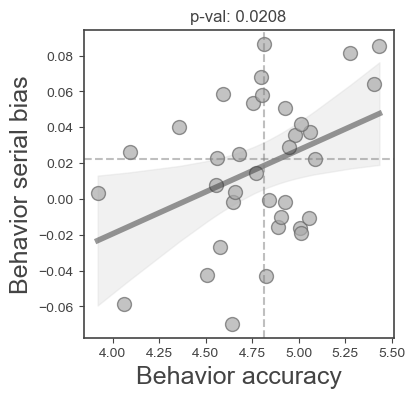
                    </figure>
                    <figure style="margin: 10px; text-align: center;">
                        <figcaption>Click</figcaption>
                        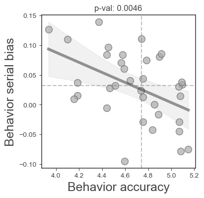
                    </figure>
                

            </figure>
        - Question: therefore, do SD in gaze has anything to do with performance?
            <figure style="text-align: center;">
                <caption><strong>Gaze Serial Bias v.s. Bheavior Accuracy</strong></caption>
                

                    <figure style="margin: 10px; text-align: center;">
                        <figcaption>Draw</figcaption>
                        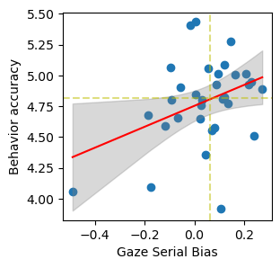
                    </figure>
                    <figure style="margin: 10px; text-align: center;">
                        <figcaption>Click</figcaption>
                        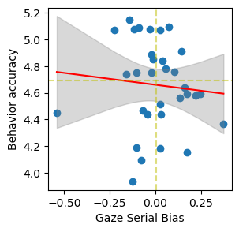
                    </figure>
                

            </figure>
    - Within-subject, trial-wise analysis
        - Previous analysis suggests no significant correlation with gaze bias and behavior bias at subject level. Now we switch to the relationship between gaze and behavior bias at trial level
        - Methods: for each trial, we determine whether it is above or below the median bias within its sd-diff bin (cut into 6) and mode.
        <figure style="text-align: center;">
            <caption><strong>Serial Bias (function of relative sd bias)</strong></caption>
            
within same phase

            

                <figure style="margin: 10px; text-align: center;">
                    <figcaption>Draw</figcaption>
                    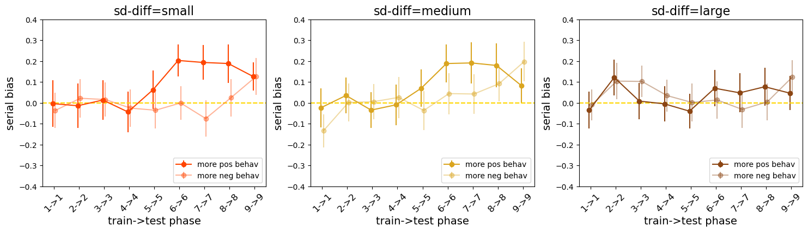
                </figure>
                <figure style="margin: 10px; text-align: center;">
                    <figcaption>Click</figcaption>
                    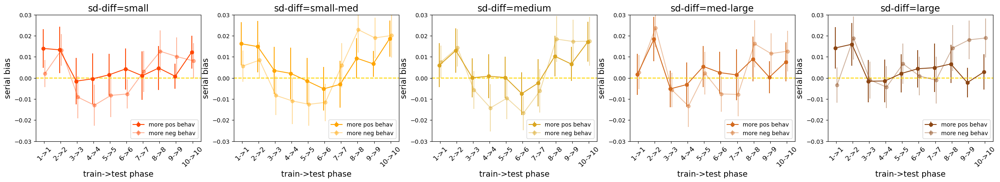
                </figure>
            

            
across adjacent phases

            

                <figure style="margin: 10px; text-align: center;">
                    <figcaption>Draw</figcaption>
                    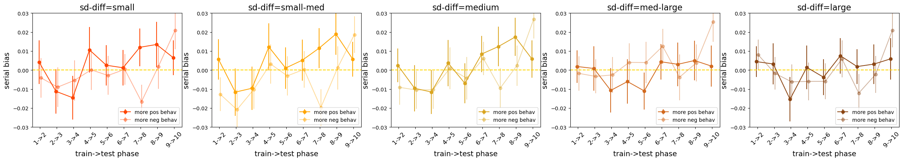
                </figure>
                <figure style="margin: 10px; text-align: center;">
                    <figcaption>Click</figcaption>
                    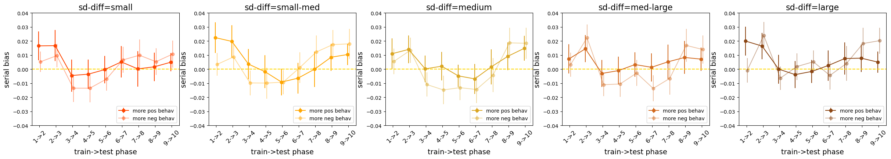
                </figure>
            

        </figure>

        - Combining across two modes, we can better see the difference in gaze pattern between trials of 'more positive behavior' v.s. 'more negative behavior'. Also note as sd-difference increase how the timepoint the decoded gaze-bias most differs change.
         <figure style="text-align: center;">
            <caption><strong>Serial Bias (function of relative sd bias)</strong></caption>
            

                <figure style="margin: 10px; text-align: center;">
                    <figcaption>within same phase</figcaption>
                    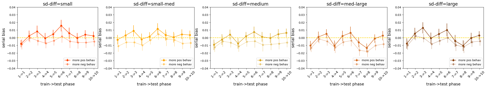
                </figure>
            

            

                <figure style="margin: 10px; text-align: center;">
                    <figcaption>phase t -> phase t+1</figcaption>
                    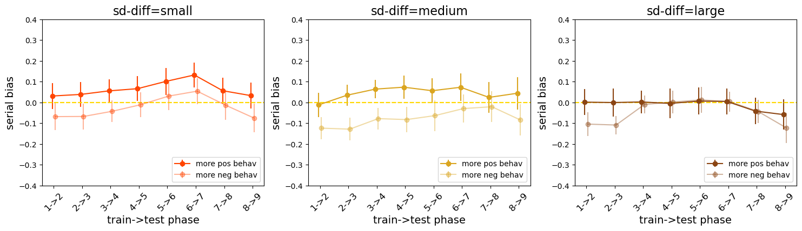
                </figure>
            

        </figure>

- Note that not all behavior biases manifests in gaze data
    - surrounding bias: the difficulty of measuring it in inverted encoding results...
        - but within data of 1 item only, we do see the bias goes from repulsive to attractive???
        <figure style="text-align: center;">
            <caption><strong>Cardinal / Oblique bias</strong></caption>
            

                <figure style="margin: 10px; text-align: center;">
                    <figcaption>Behavior</figcaption>
                    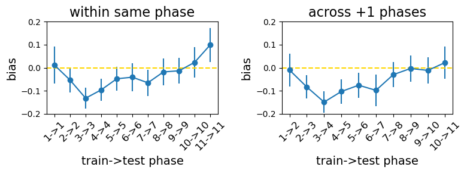
                </figure>
            

        </figure>

    - cardinal/oblique bias: 
        <figure style="text-align: center;">
            <caption><strong>Cardinal / Oblique bias</strong></caption>
            

                <figure style="margin: 10px; text-align: center;">
                    <figcaption>Behavior</figcaption>
                    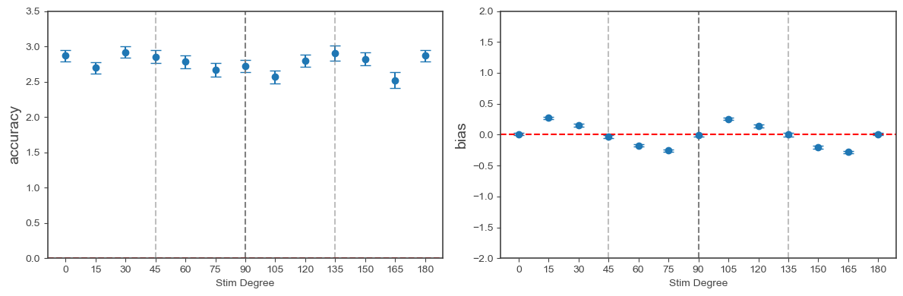
                </figure>
            

            

                <figure style="margin: 10px; text-align: center;">
                    <figcaption>Gaze (delay) </figcaption>
                    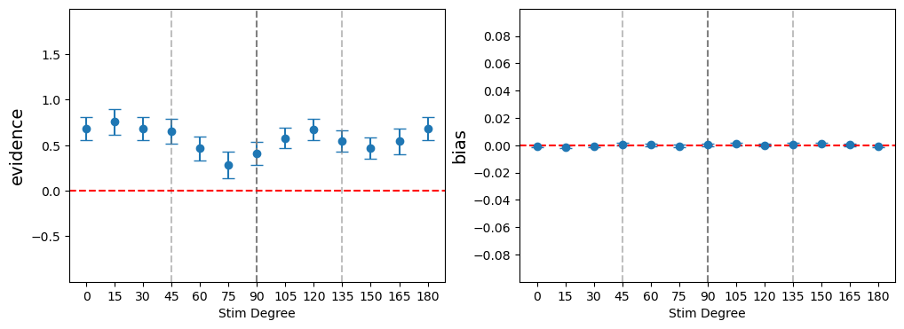
                </figure>
            

            

                <figure style="margin: 10px; text-align: center;">
                    <figcaption>Gaze (ISI) </figcaption>
                    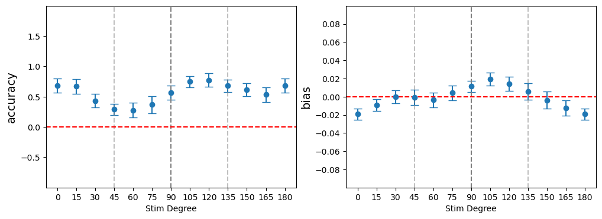
                </figure>
            

            

                <figure style="margin: 10px; text-align: center;">
                    <figcaption>Gaze (delay) </figcaption>
                    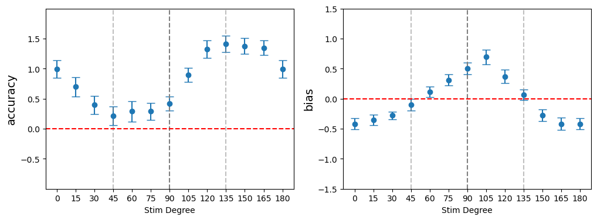
                </figure>
            

        </figure>
        *comments*: while there are still some correspondence, for example worse accuracy around the cardinal orientations, in gaze pattern we do not see the bias curves observed in behaviors. Maybe it is because eye-gaze itself has its own intrinsic bias?

#### Gaze Patterns Reflect Certainty and Effort in Action Rehearsal
Eye gaze patterns not only indicate certainty about action outcomes but may also reflect the effort invested in rehearsal, suggesting that people adjust rehearsal intensity based on action certainty and the varying costs of rehearsal across response modalities.

##### Cued v.s. Uncued
- RSA results
<figure style="text-align: center;">
    <caption><strong>RSA: compare certain v.s. uncertain</strong></caption>
    

        <figure style="margin: 10px; text-align: center;">
            <figcaption>mean gaze location</figcaption>
            
        </figure>
    

    

        <figure style="margin: 10px; text-align: center;">
            <figcaption>angle distribution</figcaption>
            
        </figure>
    

</figure>

- MVPA results
- relevance results
##### Same analysis for hand motions

#### Gaze Provides a Measure for the Oscillatory Rehearsal of Multiple Items
When multiple items are remembered, they are rehearsed in a rhythmic manner. Gaze data procide a straightforward and relatively way to investigate such oscillatory process. The result suggests that even the memoranda are controlled, responsemodality will systematically affect the dynamics of this process

##### General Frequency Analysis Results

<figure style="text-align: center;">
    <caption><strong>Frequency analysis: compare draw v.s. click</strong></caption>
    

        <figure style="margin: 10px; text-align: center;">
            <figcaption>draw</figcaption>
            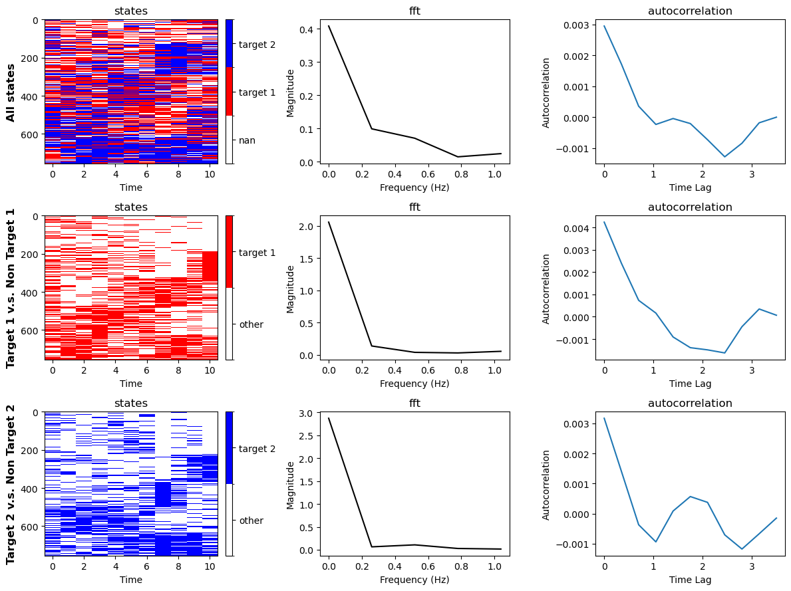
        </figure>
        <figure style="margin: 10px; text-align: center;">
            <figcaption>click</figcaption>
            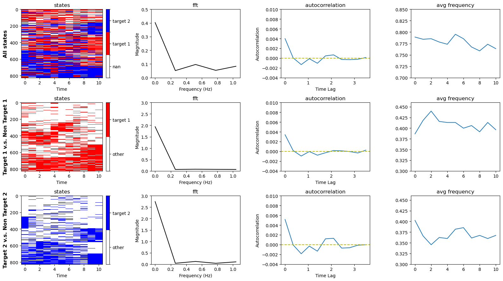
        </figure>
    

</figure>
- comments:
    - According to the autocorrelation plot + frequency plot it seems suggesting that clicking is rehersaled at a faster speed. Clicking seems to have been rehersaled two cycles, while drawing is one cycle? Also the results suggest that their is a preference to practice a certain item first, but the order has something to do with which mode we are in.
-  *TODO*: what are those clusters: within or across subjects?

##### How the rivalry between concurrent memory morph over time
- frequency change
- development of repulsive biases
- other factors controling the process

## Supplementary

### Example of inverted encoding prediction

- Example of predicted distribution of gaze (compared with the actual 2d heatmaps shown above)
<figure style="text-align: center;">
    <caption><strong>Pixel-wise normalized Heatmap of Gaze</strong></caption>
    

        <figure style="margin: 10px; text-align: center;">
            <figcaption>Actual</figcaption>
            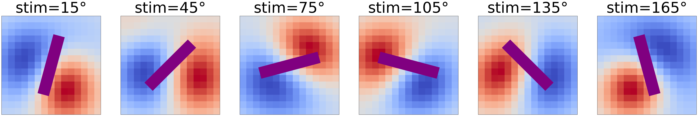
        </figure>
    

    

        <figure style="margin: 10px; text-align: center;">
            <figcaption>Reconstructed</figcaption>
            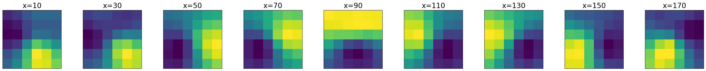
        </figure>
    

    <figcaption style="margin-top: 10px;">Average 2D heatmap of distribution of gaze during the delay, as a function of stimuli.</figcaption>
</figure>

### Individual differences

## References